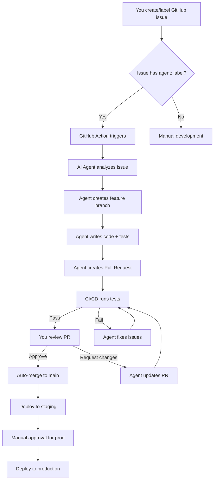

# Quantified Me - AI Development Roadmap

**Repository**: https://github.com/joel-wehr/quantified-me
**Project Board**: https://github.com/users/joel-wehr/projects/3
**Development Strategy**: AI-First, Fully Automated

---

## Overview

This project will be built **entirely by AI agents** working autonomously through GitHub issues. Each feature has been broken down into discrete tasks that AI agents can complete independently.

### Key Principles
1. **AI-First Development**: Every feature implemented by specialized AI agents
2. **Automated Workflows**: GitHub Actions trigger agents on issue labels
3. **Comprehensive Testing**: All code includes automated tests
4. **Continuous Integration**: Auto-deploy to staging/production
5. **Human Oversight**: You review and merge AI-generated PRs

---

## Development Phases

### Phase 1: Foundation (Weeks 1-2)
**Goal**: Core infrastructure, authentication, basic database

| # | Issue | Agent | Priority | Status |
|---|-------|-------|----------|--------|
| [#1](https://github.com/joel-wehr/quantified-me/issues/1) | Add React Router | Frontend | HIGH | 🟡 Ready |
| [#2](https://github.com/joel-wehr/quantified-me/issues/2) | Integrate Chart.js | Frontend | HIGH | 🟡 Ready |
| [#3](https://github.com/joel-wehr/quantified-me/issues/3) | Create API endpoints | Backend | HIGH | 🟡 Ready |
| [#4](https://github.com/joel-wehr/quantified-me/issues/4) | Setup PostgreSQL | Backend | HIGH | 🟡 Ready |
| [#5](https://github.com/joel-wehr/quantified-me/issues/5) | AWS Cognito auth | Backend | HIGH | 🟡 Ready |
| [#6](https://github.com/joel-wehr/quantified-me/issues/6) | Login/Register pages | Frontend | HIGH | 🟡 Ready |

**Deliverables**:
- ✅ Working authentication system
- ✅ Database with migrations
- ✅ RESTful API for metrics
- ✅ Interactive dashboard with charts
- ✅ Client-side routing

---

### Phase 2: Core Features (Weeks 3-4)
**Goal**: Data entry, CSV import, visualization

| # | Issue | Agent | Priority | Status |
|---|-------|-------|----------|--------|
| [#7](https://github.com/joel-wehr/quantified-me/issues/7) | Manual data entry form | Frontend | HIGH | 🔵 Queued |
| [#8](https://github.com/joel-wehr/quantified-me/issues/8) | CSV import | Frontend+Backend | HIGH | 🔵 Queued |
| [#9](https://github.com/joel-wehr/quantified-me/issues/9) | Data normalization | Backend | MEDIUM | 🔵 Queued |
| [#10](https://github.com/joel-wehr/quantified-me/issues/10) | Dashboard data integration | Frontend | HIGH | 🔵 Queued |

**Deliverables**:
- ✅ Users can manually enter health data
- ✅ Bulk data import via CSV
- ✅ Real-time dashboard with live data
- ✅ Data normalization and validation

---

### Phase 3: AI Features (Weeks 5-6)
**Goal**: Claude integration, insights, recommendations

| # | Issue | Agent | Priority | Status |
|---|-------|-------|----------|--------|
| [#11](https://github.com/joel-wehr/quantified-me/issues/11) | Claude API integration | Backend | HIGH | 🔵 Queued |
| [#12](https://github.com/joel-wehr/quantified-me/issues/12) | Insights dashboard | Frontend | HIGH | 🔵 Queued |
| [#13](https://github.com/joel-wehr/quantified-me/issues/13) | AI chat interface | Frontend+Backend | MEDIUM | 🔵 Queued |
| [#14](https://github.com/joel-wehr/quantified-me/issues/14) | Recommendation engine | Backend+Data | MEDIUM | 🔵 Queued |

**Deliverables**:
- ✅ AI-generated health insights
- ✅ Interactive chat with health data
- ✅ Personalized recommendations
- ✅ Pattern detection algorithms

---

## AI Agent Workflow

### How It Works



### Agent Types

#### 1. Frontend Developer Agent (`agent:frontend`)
**Expertise**: React, TypeScript, Phoenix theme, Charts
**Typical Tasks**:
- Build UI components
- Integrate APIs
- Add routing
- Create forms with validation
- Implement responsive design

#### 2. Backend Developer Agent (`agent:backend`)
**Expertise**: Node.js, Express, PostgreSQL, AWS
**Typical Tasks**:
- Create REST APIs
- Database migrations
- Authentication
- Data validation
- AWS service integration

#### 3. DevOps Agent (`agent:devops`)
**Expertise**: AWS, Terraform, CI/CD, Docker
**Typical Tasks**:
- Infrastructure as Code
- GitHub Actions workflows
- Deployment automation
- Monitoring setup
- Security configurations

#### 4. Data Engineer Agent (`agent:data`)
**Expertise**: PostgreSQL, data pipelines, ETL
**Typical Tasks**:
- Database schema design
- Data normalization
- Query optimization
- ETL pipelines
- Analytics queries

#### 5. Testing Agent (`agent:testing`)
**Expertise**: Jest, Vitest, Playwright, security
**Typical Tasks**:
- Unit tests
- Integration tests
- E2E tests
- Security audits
- Performance testing

#### 6. Documentation Agent (`agent:docs`)
**Expertise**: Technical writing, API docs
**Typical Tasks**:
- API documentation
- User guides
- Code comments
- Architecture diagrams
- Changelog updates

---

## How to Use This Roadmap

### Step 1: Review Phase 1 Issues

Visit the [GitHub Project Board](https://github.com/users/joel-wehr/projects/3) and review Phase 1 issues (#1-#6).

### Step 2: Trigger AI Agents

For each issue you want to work on:

**Option A: Use GitHub UI**
1. Go to the issue
2. Ensure it has the correct `agent:*` label
3. The GitHub Action will automatically trigger

**Option B: Use GitHub CLI**
```bash
# The issues already have the correct labels
# Just ensure the AI Agent GitHub Action is enabled
gh workflow enable ai-agent.yml --repo joel-wehr/quantified-me
```

### Step 3: Monitor Progress

**Check PR Status**:
```bash
gh pr list --repo joel-wehr/quantified-me
```

**View Project Board**:
https://github.com/users/joel-wehr/projects/3

**Check CI/CD Status**:
```bash
gh run list --repo joel-wehr/quantified-me
```

### Step 4: Review & Merge

When AI agents create PRs:
1. Review the code changes
2. Check that tests pass
3. Verify functionality locally (optional)
4. Approve and merge

### Step 5: Deploy

After merging to `main`:
- Staging deployment happens automatically
- Production requires manual approval

---

## Configuration Required

### GitHub Secrets

Add these secrets to enable AI agents and deployments:

```bash
# Navigate to: https://github.com/joel-wehr/quantified-me/settings/secrets/actions

# AI API Keys
ANTHROPIC_API_KEY=sk-ant-...          # For AI agent development
OPENAI_API_KEY=sk-...                 # Optional, for alternative AI features

# AWS Credentials
AWS_ACCESS_KEY_ID=AKIA...
AWS_SECRET_ACCESS_KEY=...
AWS_REGION=us-east-1
AWS_ACCOUNT_ID=978610353956           # Your AWS account

# Deployment
STAGING_S3_BUCKET=quantified-me-staging
STAGING_CF_DIST_ID=E...               # CloudFront distribution
PROD_S3_BUCKET=quantified-me-prod
PROD_CF_DIST_ID=E...

# Database (for CI/CD)
TEST_DATABASE_URL=postgresql://...    # Test database for CI
```

### AWS Infrastructure Setup

Before AI agents can deploy, set up AWS infrastructure:

**Option 1: Manual Setup**
1. Create S3 buckets for frontend hosting
2. Set up CloudFront distributions
3. Create RDS PostgreSQL instance
4. Configure Cognito User Pool

**Option 2: Use Terraform (Recommended)**
```bash
# Create a DevOps agent issue to set this up
gh issue create \
  --repo joel-wehr/quantified-me \
  --title "[Agent]: Set up AWS infrastructure with Terraform" \
  --label "agent:devops,priority:high,phase:1" \
  --body "Create Terraform configuration for all AWS resources (S3, CloudFront, RDS, Cognito)"
```

---

## Monitoring AI Development

### Daily Checks

**Morning**: Review overnight PR activity
```bash
gh pr list --repo joel-wehr/quantified-me --state all --created $(date -d yesterday +%Y-%m-%d)
```

**Afternoon**: Check CI/CD status
```bash
gh run list --repo joel-wehr/quantified-me --limit 10
```

**Evening**: Review merged code
```bash
git log --oneline --since="1 day ago"
```

### Weekly Reviews

1. **Sprint Review**: What was completed this week?
2. **Code Quality**: Run security scans, check test coverage
3. **Deployment Status**: Verify staging environment
4. **Next Week Planning**: Prioritize next phase issues

### Quality Metrics

Track these metrics weekly:
- **PR Merge Rate**: % of AI PRs merged without changes
- **Test Coverage**: Should stay >80%
- **Build Success Rate**: Should be >95%
- **Deployment Frequency**: Aim for daily to staging
- **Time to Production**: From issue create to prod deploy

---

## Troubleshooting

### AI Agent Not Creating PR

**Check**:
1. Issue has correct `agent:*` label
2. GitHub Action is enabled: `.github/workflows/ai-agent.yml`
3. ANTHROPIC_API_KEY secret is set
4. Check Action logs for errors

**Fix**:
```bash
# Re-trigger the workflow
gh workflow run ai-agent.yml --repo joel-wehr/quantified-me
```

### Tests Failing in CI

**Check**:
1. Review test logs in GitHub Actions
2. Run tests locally to reproduce
3. Check for environment-specific issues

**Fix**:
- Comment on the PR with specific failures
- AI agent will auto-fix and update PR

### Deployment Failing

**Check**:
1. AWS credentials are valid
2. S3 bucket exists and is accessible
3. CloudFront distribution configured

**Fix**:
```bash
# Manually deploy if needed
npm run build
aws s3 sync frontend/dist s3://quantified-me-staging
```

---

## Cost Estimates

### AI API Costs (Claude)

**Development Phase** (Weeks 1-6):
- ~14 AI agent tasks
- Est. $5-10 per task (code generation + iterations)
- **Total**: ~$70-140

**Ongoing** (Monthly):
- User-facing AI features (insights, chat)
- Depends on usage
- Est. $50-200/month for 100 active users

### AWS Costs (Monthly)

**Staging + Production**:
- S3 + CloudFront: $10-20
- RDS PostgreSQL: $50-100
- Cognito: $0-5 (free tier)
- Lambda (if used): $5-10
- **Total**: ~$65-135/month

### GitHub Costs

- **Free**: Public repository, Actions minutes (2000/month free)
- **If needed**: GitHub Teams ($4/user/month for private repos)

---

## Success Criteria

### Phase 1 Complete When:
- [ ] All Phase 1 issues closed
- [ ] Authentication working end-to-end
- [ ] Database populated with test data
- [ ] Dashboard displaying charts
- [ ] All tests passing
- [ ] Deployed to staging

### Phase 2 Complete When:
- [ ] Users can manually add health data
- [ ] CSV import functional
- [ ] Dashboard shows real user data
- [ ] Data normalization working
- [ ] All tests passing
- [ ] Deployed to production

### Phase 3 Complete When:
- [ ] AI insights generating
- [ ] Chat interface working
- [ ] Recommendations displaying
- [ ] All features tested
- [ ] Production stable
- [ ] User documentation complete

---

## Next Steps

### Immediate (Today)

1. **Configure GitHub Secrets**
   - Add ANTHROPIC_API_KEY
   - Add AWS credentials
   - Add deployment secrets

2. **Verify GitHub Actions**
   ```bash
   gh workflow list --repo joel-wehr/quantified-me
   ```

3. **Review Phase 1 Issues**
   - Visit: https://github.com/joel-wehr/quantified-me/issues
   - Read each issue carefully
   - Ensure you understand the requirements

### This Week

1. **Start Phase 1 Development**
   - Issues will auto-trigger AI agents
   - Monitor PR creation
   - Review and merge PRs as they arrive

2. **Set Up AWS Infrastructure**
   - Can be done manually or via DevOps agent
   - Priority: RDS database for backend work

3. **Daily PR Reviews**
   - Check GitHub notifications
   - Review AI-generated code
   - Merge quality PRs

### Next Week

1. **Complete Phase 1**
   - All 6 issues should have PRs merged
   - Staging deployment verified
   - Basic app functional

2. **Begin Phase 2**
   - Start with high-priority issues
   - Continue daily PR reviews

---

## Resources

- **Repository**: https://github.com/joel-wehr/quantified-me
- **Project Board**: https://github.com/users/joel-wehr/projects/3
- **Documentation**: See `/docs` folder in repository
- **Architecture**: See `ARCHITECTURE.md`
- **AI Workflow Guide**: See `docs/AI_WORKFLOW.md`

---

## Support

**Questions or Issues?**
- Create a GitHub issue with `question` label
- Check existing documentation in `/docs`
- Review `PROJECT_STATUS.md` for current state

---

**Last Updated**: 2025-11-10
**Status**: ✅ Ready for AI Development
**Next Milestone**: Phase 1 Complete (Target: 2 weeks)
