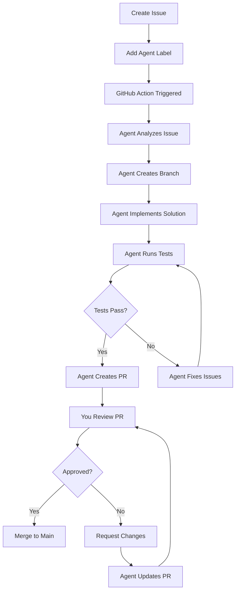

# AI-Assisted Development Workflow

This document explains how to use AI sub-agents to accelerate development of Quantified Me.

## Overview

Quantified Me uses specialized AI agents to autonomously implement features, fix bugs, and maintain the codebase. Each agent is designed for specific tasks and has access to relevant tools and context.

## Available AI Agents

### 1. Backend Developer Agent
**Label**: `agent:backend`

**Responsibilities**:
- Implement API endpoints
- Create database models and migrations
- Write business logic
- Integrate with AWS services
- Add authentication and authorization

**Example Tasks**:
- Create a new REST API endpoint for health metrics
- Implement data validation schemas
- Add database migration for new table
- Integrate with S3 for file storage

### 2. Frontend Developer Agent
**Label**: `agent:frontend`

**Responsibilities**:
- Build React components
- Integrate Bootstrap admin template
- Create data visualizations
- Implement responsive layouts
- Connect to backend API

**Example Tasks**:
- Create dashboard component with charts
- Build data entry form with validation
- Implement responsive navigation
- Add dark mode support

### 3. DevOps Agent
**Label**: `agent:devops`

**Responsibilities**:
- Write GitHub Actions workflows
- Create infrastructure as code (Terraform/CDK)
- Set up CI/CD pipelines
- Configure AWS services
- Optimize deployment process

**Example Tasks**:
- Create GitHub Action for automated testing
- Write Terraform config for RDS setup
- Set up CloudFront distribution
- Configure auto-scaling policies

### 4. Data Engineer Agent
**Label**: `agent:data`

**Responsibilities**:
- Design database schemas
- Build ETL pipelines
- Implement data normalization
- Create aggregation queries
- Optimize database performance

**Example Tasks**:
- Design schema for time-series metrics
- Build CSV import pipeline
- Create data normalization engine
- Optimize slow queries

### 5. Testing Agent
**Label**: `agent:testing`

**Responsibilities**:
- Write unit tests
- Create integration tests
- Implement E2E tests
- Perform security audits
- Generate test data

**Example Tasks**:
- Write unit tests for API endpoints
- Create integration test suite
- Add E2E tests for user flows
- Generate realistic test data

### 6. Documentation Agent
**Label**: `agent:docs`

**Responsibilities**:
- Write API documentation
- Create user guides
- Update architecture docs
- Generate code comments
- Maintain changelog

**Example Tasks**:
- Document new API endpoints
- Create user guide for data import
- Update architecture diagrams
- Write inline code documentation

## How to Use AI Agents

### Method 1: Create an Issue with Agent Label

1. **Create a new issue** on GitHub
2. **Choose the template**: "AI Agent Task"
3. **Fill in the details**:
   - Select the appropriate agent type
   - Provide a clear task description
   - Define acceptance criteria
   - Add any additional context
4. **Add the agent label**: The issue template will automatically suggest the correct label (e.g., `agent:backend`)
5. **Submit the issue**

The agent will:
- Analyze the requirements
- Create a new branch
- Implement the solution
- Run tests
- Create a pull request
- Request your review

### Method 2: Label an Existing Issue

1. **Create or find an issue**
2. **Add the appropriate agent label** (e.g., `agent:frontend`)
3. **The GitHub Action will trigger** and invoke the AI agent

### Method 3: Use in Pull Request Comments

Comment on a PR with:
```
@ai-agent please review this code
```
or
```
@ai-agent implement the requested changes
```

## Writing Effective Agent Tasks

### Good Task Description ✅

```markdown
**Agent Type**: Backend Developer Agent

**Task**: Create a REST API endpoint for submitting health metrics

**Requirements**:
- POST /api/v1/metrics
- Accept JSON body with: metric_type, metric_name, value, unit, timestamp
- Validate input using Zod schema
- Store in PostgreSQL database
- Return created metric with ID
- Add rate limiting (100 requests/hour per user)

**Acceptance Criteria**:
- [ ] Endpoint responds to POST requests
- [ ] Input validation works correctly
- [ ] Data is stored in database
- [ ] Rate limiting is enforced
- [ ] Unit tests pass (>80% coverage)
- [ ] API documentation is updated

**Context**:
- Related files: backend/src/routes/metrics.ts
- Database schema: shared/schemas/health_metrics.sql
- Similar endpoint: backend/src/routes/users.ts
```

### Poor Task Description ❌

```markdown
Add a metrics endpoint
```

**Why it's poor**:
- Not specific enough
- No acceptance criteria
- Missing technical requirements
- No context provided

## Agent Workflow



## Best Practices

### 1. Be Specific
Provide detailed requirements and acceptance criteria. The more specific you are, the better the agent can implement your vision.

### 2. Break Down Large Tasks
Instead of "Build the entire dashboard", create separate issues:
- "Create dashboard layout component"
- "Add metrics chart component"
- "Implement data fetching logic"
- "Add responsive design"

### 3. Provide Context
Link to related files, similar implementations, or design documents. This helps the agent understand the codebase patterns.

### 4. Define Success Criteria
Use checkboxes to define what "done" means:
- [ ] Feature works as expected
- [ ] Tests pass
- [ ] Documentation updated
- [ ] No breaking changes

### 5. Review Agent PRs Carefully
AI agents are powerful but not perfect. Always:
- Review the code for logic errors
- Check for security vulnerabilities
- Verify tests are comprehensive
- Ensure documentation is accurate

### 6. Iterate
If the agent's first attempt isn't perfect:
- Request specific changes in the PR
- The agent will update based on your feedback
- Continue until satisfied

## GitHub Labels

Use these labels to control agent behavior:

| Label | Purpose |
|-------|---------|
| `agent:backend` | Trigger backend developer agent |
| `agent:frontend` | Trigger frontend developer agent |
| `agent:devops` | Trigger DevOps agent |
| `agent:data` | Trigger data engineer agent |
| `agent:testing` | Trigger testing agent |
| `agent:docs` | Trigger documentation agent |
| `ai-assisted` | Mark as AI-assisted (auto-added) |
| `needs-review` | Agent PR ready for review |
| `priority:high` | High priority task |
| `breaking-change` | Will require version bump |

## Monitoring Agent Performance

Track agent effectiveness through:
- **Success Rate**: % of agent PRs merged without changes
- **Time to PR**: How quickly agents create PRs
- **Code Quality**: Test coverage, linting, security
- **Review Feedback**: Common issues that require human correction

## Troubleshooting

### Agent Didn't Create a PR
1. Check GitHub Actions logs
2. Verify the issue has the correct label
3. Ensure the task description is clear
4. Check for API rate limits or quota issues

### Agent Implementation is Incorrect
1. Provide specific feedback in PR comments
2. Reference correct examples from codebase
3. Update the issue with more context
4. Request agent to revise

### Tests are Failing
1. Agent will automatically attempt to fix
2. If it fails multiple times, review the test failures
3. Provide guidance in PR comments
4. Consider breaking into smaller tasks

## Future Enhancements

Planned improvements to the AI workflow:

- [ ] Multi-agent collaboration on complex features
- [ ] Automated code review before PR creation
- [ ] Learning from merged PRs to improve future implementations
- [ ] Integration with project management tools
- [ ] Automated dependency updates and security patches

---

For questions or issues with the AI workflow, create an issue with the `question` label.
